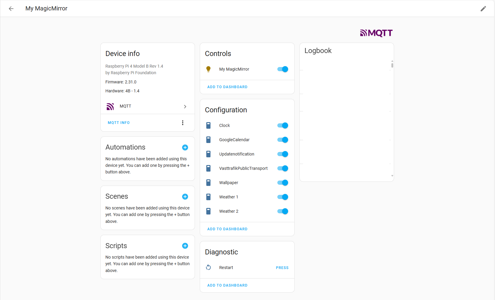

# MMM-HomeAssistant
A MagicMirror² module that creates an MQTT device with Home Assistant autodiscovery.

> **Note:** This module was greatly inspired by [MMM-Remote-Control](https://github.com/Jopyth/MMM-Remote-Control).


*Example: MagicMirror entities in Home Assistant*

## How it works

When the MagicMirror starts, the first browser client to load the module will establish the MQTT connection and handle all communication with Home Assistant. This ensures only one active MQTT connection per MagicMirror instance, even if multiple browsers are open.

The module uses MQTT autodiscovery to automatically create entities in Home Assistant, allowing you to control your MagicMirror from the Home Assistant dashboard or automations without manual configuration.

## Features

- MQTT device integration with Home Assistant via autodiscovery
- Control MagicMirror monitor (on/off)
- Adjust MagicMirror brightness
- Control visibility of individual MagicMirror modules as switches
- Restart MagicMirror process via Home Assistant

## Installation

### Install

In your terminal, go to your [MagicMirror²][mm] Module folder and clone MMM-HomeAssistant:

```bash
cd ~/MagicMirror/modules
git clone https://github.com/ambarusa/MMM-HomeAssistant/
npm install
```

### Update

```bash
cd ~/MagicMirror/modules/MMM-HomeAssistant
git pull
npm install
```

## Using the module

To use this module, add it to the modules array in the `config/config.js` file:

```js
{
    module: 'MMM-HomeAssistant',
    config: {
        mqttServer: 'mqtt://localhost',
        mqttPort: 1883,
        username: 'mqtt_username'
        password: 'mqtt_password',
        deviceName: 'My MagicMirror',
        autodiscoveryTopic: 'homeassistant',
        monitorControl: true,
        brightnessControl: true,
        moduleControl: true,
        monitorStatusCommand: 'xrandr --query | awk \'/Screen/ {print ($8 > 320) ? "true" : "false"}\''
        monitorOnCommand: 'xrandr -d :0 --output HDMI-1 --auto --rotate right',
        monitorOffCommand: 'xrandr -d :0 --output HDMI-1 --off',
        pm2ProcessName: 'mm',
    }
},
```

## Configuration options

| Option                | Type     | Default             | Description                                                                                                         |
|-----------------------|----------|---------------------|---------------------------------------------------------------------------------------------------------------------|
| `mqttServer`          | string   | `mqtt://localhost`  | MQTT server address (e.g., `mqtt://localhost`).                                                                     |
| `mqttPort`            | int      | `1883`              | MQTT port.                                                                                                          |
| `username`            | string   | *(none)*            | *(Optional)* MQTT username. If omitted, connects anonymously.                                                       |
| `password`            | string   | *(none)*            | *(Optional)* MQTT password.                                                                                         |
| `deviceName`          | string   | `My MagicMirror`    | MQTT device name.                                                                                                   |
| `autodiscoveryTopic`  | string   | `homeassistant`     | Autodiscovery topic for Home Assistant.                                                                             |
| `monitorControl`      | boolean  | `false`             | Treat the display as an ON/OFF light entity.                                                                        |
| `brightnessControl`   | boolean  | `false`             | Treat the display as a light entity with brightness. Enables monitorControl!                                        |
| `monitorStatusCommand`| string   | `echo true`         | Shell command to check the monitor status; must return `true`/`false` or `0`/`1` for correct operation.             |
| `monitorOnCommand`    | string   | *(none)*            | Shell command to turn on the monitor.                                                                               |
| `monitorOffCommand`   | string   | *(none)*            | Shell command to turn off the monitor.                                                                              |
| `moduleControl`       | boolean  | `true`              | Make modules controllable as switch entities.                                                                       |
| `pm2ProcessName`      | string   | *(none)*            | If set, allows MagicMirror to be restarted via Home Assistant.                                                      |

## Home Assistant Integration

Entities will appear automatically in Home Assistant if MQTT autodiscovery is enabled. You can control your MagicMirror from the Home Assistant dashboard or automations.

## Troubleshooting

- Open your browser's developer console to check for JavaScript errors or warnings.
- Check the MagicMirror logs for errors or warnings (run `npm start` `npm run server` or `pm2 restart xx; pm2 logs xx` from your MagicMirror directory and watch the terminal output).
- Use [MQTT Explorer](https://mqtt-explorer.com/) or a similar tool to easily investigate MQTT messages and topics.
- Optionally, you can temporarily change the `autodiscoveryTopic` in your config to something like `debug` to see what messages are intended to be sent for Home Assistant autodiscovery.


## Known limitations

This module struggles to handle multiple instances of browsers. The MQTT connection is established from the first opening browser, but any change from other browser instances can update the MQTT status, which may lead to inconsistent state reporting. This is usually not a problem in normal use and especially occurs when debugging is done. Simply opening and closing a browser instance does not cause any harm.


## Developer commands

- `npm install` - Install devDependencies like ESLint.
- `npm run lint` - Run linting and formatter checks.
- `npm run lint:fix` - Fix linting and formatter issues.

[mm]: https://github.com/MagicMirrorOrg/MagicMirror
